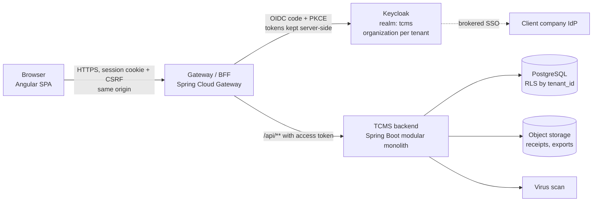

# TCMS — Project Kickoff Strategy

**Status:** kickoff decisions, 2026-09-24. **Companion to:** [TCMS_FRONTEND_README.md](TCMS_FRONTEND_README.md). **Starting point:** greenfield — no frontend, backend, or OpenAPI exists yet.

This document fixes the strategic decisions that are expensive to change later, lists the ones that can wait, and lays out how the first weeks run. Each decision has a short rationale and a "revisit if" trigger so it can be challenged deliberately rather than drift.

---

## 1. Decisions taken now

| # | Decision | Choice | Why | Revisit if |
| --- | --- | --- | --- | --- |
| D1 | Frontend framework | **Angular** (current stable major, standalone components, strict TypeScript, signals) | Forms- and workflow-heavy multi-role app; built-in router, reactive forms, HttpClient interceptors, i18n; familiar to a Java/Spring team | Team composition shifts to React-first |
| D2 | Backend platform | **Java 25 LTS + Spring Boot 4.x** (confirm latest patch at kickoff) | Team skill; mature security, validation, OpenAPI tooling | — |
| D3 | Backend architecture | **Modular monolith** (Spring Modulith), one deployable, strict module boundaries: `tenancy`, `organization`, `employees`, `identity`, `policies`, `claims`, `approvals`, `settlement`, `reporting`, `audit` | Greenfield + small team: microservices add network, deployment and consistency cost before any user value. Module boundaries keep a later split possible | A module needs independent scaling or a separate team owns it |
| D4 | Identity | **Keycloak**, single realm using **Organizations** (one organization per tenant); roles/permissions mapped to the README permission names | Standard OIDC, SSO/identity brokering for client companies that bring their own IdP, MFA, password recovery out of the box. Realm-per-tenant scales poorly past dozens of tenants | Tenants demand fully isolated identity configuration |
| D5 | Browser auth pattern | **BFF / gateway session**: Spring Cloud Gateway (or the Spring app itself) performs OIDC Authorization Code + PKCE with Keycloak, keeps tokens server-side, gives the browser an `HttpOnly; Secure; SameSite` session cookie + CSRF token | No tokens in the browser at all — satisfies the README's "avoid tokens in localStorage" rule and simplifies Angular (no token refresh logic) | A native mobile app needs direct token access (add a separate public client then) |
| D6 | Repositories | **Separate repos**: `tcms-frontend`, `tcms-backend`, `tcms-infra` (Keycloak realm export, docker-compose, deployment) | Independent release cycles, as the README requires; contract is the only coupling | Contract churn becomes painful — then consider a shared contracts repo |
| D7 | API contract | **Contract-first OpenAPI 3.1**. Backend owns the spec in `tcms-backend/api/`; each release publishes a versioned artifact; frontend pins a snapshot in `contracts/` and generates its client with `ng-openapi-gen` (Node-only; chosen 2026-09-24 over `openapi-generator`, which needs Java on every frontend machine) | Lets frontend build against mocks from day one while backend implements; breaking changes become visible in CI | — |
| D8 | Error format | **RFC 9457 `ProblemDetail`** (native in Spring) with extensions `code`, `traceId`, `fieldErrors[]` | Standard, zero custom plumbing on the backend; replaces the custom envelope proposal in the README §4 | — |
| D9 | Database & tenancy | **PostgreSQL**, shared schema, `tenant_id` on every tenant-owned table, enforced by **Postgres Row-Level Security** + Hibernate tenant filter; tenant resolved from the authenticated session, never from request input alone | One DB to operate; RLS makes a forgotten `WHERE tenant_id` fail closed instead of leaking data | A client contractually requires dedicated database/schema |
| D10 | Migrations | **Flyway** | Simple, SQL-first, standard with Spring Boot | — |
| D11 | File storage | **S3-compatible object storage** (MinIO locally, S3/Azure Blob/equivalent in cloud); presigned upload/download URLs issued by backend after authorization; malware scan (ClamAV) before a receipt is usable | Keeps large files out of the DB and app servers; scan state becomes an explicit receipt status | — |
| D12 | Async jobs | **Database-backed jobs** (Spring Modulith events + a `jobs` table, or JobRunr) for imports, exports, provisioning; frontend polls job status | No message broker to operate in v1; job ID persisted so UI survives reload (FE-016) | Throughput or cross-service events require Kafka/RabbitMQ |
| D13 | UI component library | **Angular Material 3 + CDK** (revised 2026-09-24) with a thin TCMS design-token layer | MIT-licensed, maintained by the Angular team, released in step with Angular, strong accessibility and RTL. PrimeNG was the first choice but is now a commercial PrimeUI product (paid per developer above small-company limits, license key required) | Table-heavy finance screens prove too costly to build on Material + CDK tables |
| D14 | Frontend tooling | npm, ESLint, Prettier, **Vitest** (unit/component), **Playwright** (E2E), **MSW** in a dedicated `mock` build configuration, with fabricated personas and a mock sign-in page; Transloco for runtime i18n | One unit runner, not two; mocks derived from the contract | — |
| D15 | Localization | Arabic + English from day one (Transloco, runtime switch in one build), RTL tested in every screen's definition of done | Retro-fitting RTL is far more expensive than building with it | Product confirms English-only for first release |
| D16 | Deployment shape | Containers (Docker). Same origin: `https://app.<domain>/` serves Angular (nginx), `/api/**` routes to backend via the gateway. Environments: LOCAL (docker-compose), DEV, STAGING, PROD | Same origin removes CORS and third-party cookie problems with the BFF session | — |
| D17 | Runtime frontend config | One build promoted through environments; settings loaded at startup from `/config.json` served per environment (not `.env`, which Angular does not read at runtime) | Build once, deploy many; no rebuild per environment | — |
| D18 | Observability | OpenTelemetry in backend; `traceId` returned in every error and shown in UI; frontend error reporting (e.g. Sentry or equivalent) tagged with the same trace ID | Support can follow a user-reported error across browser and server | — |
| D19 | Architecture decision records | Every decision above becomes a one-page ADR in each repo's `docs/adr/`; later decisions follow the same format | Makes reversals deliberate and reviewable | — |

### Deferred on purpose (decide when the trigger arrives)

| Topic | Decide when | Default until then |
| --- | --- | --- |
| Cloud provider / hosting | Before STAGING environment | docker-compose locally, any container host for DEV |
| CI system | Repo creation | Whatever hosts the repos (GitHub Actions / GitLab CI) |
| Uber/Careem, email sync, OCR | Phase 08+ scoping | Manual receipt upload only |
| External HR / finance connectors | First client needing them | CSV import + CSV/XLSX export |
| Notifications channel (email/SMS/push) | Phase 09 | In-app status only |
| Microservice split | A module hits D3's revisit trigger | Modular monolith |
| Mobile app | After web MVP adoption | Responsive web |

---

## 2. Target architecture (v1)

---

## 3. Execution plan

Two-week sprints. Sprint 0 is setup only; nothing user-facing is promised until Sprint 1.

### Sprint 0 — Foundations (weeks 1–2)

**Backend + infra**
- Create `tcms-backend`, `tcms-infra`; docker-compose with PostgreSQL, Keycloak (realm export committed), MinIO, ClamAV.
- Spring Boot skeleton with Modulith module layout, Flyway, `ProblemDetail` handler, OpenTelemetry, RLS tenant plumbing, and an architecture test that fails if modules reach into each other's internals.
- First OpenAPI draft: `GET /api/v1/me`, tenant context, pagination/error conventions.

**Frontend**
- Create `tcms-frontend`: Angular strict, Angular Material, i18n with Arabic/English + RTL switch, routing shell (A01, A03, A04), `/config.json` loader.
- Core: generated API client, HTTP interceptors (CSRF, trace ID, error mapping, 401 → login, 403 → forbidden, 409/412 conflict), permission guard, tenant-scoped cache that clears on sign-out/tenant switch.
- Mock server from the OpenAPI snapshot; CI pipeline: install → lint → typecheck → unit → contract check → build.

**Joint**
- Close the "contract questions" table in README §8 for the first slice: error format (D8), pagination, date/money, upload limits, claim state machine, idempotency key header.
- Designer delivers flows for the first slice screens including mobile + RTL states.

**Exit criteria:** a user can sign in through Keycloak via the BFF, `/me` returns their tenant and permissions, the Angular shell shows role-based navigation in Arabic and English, and CI is green in both repos.

### Sprint 1–2 — Tenant, organization, employees (weeks 3–6)
Screens T01–T03, O01–O02, H01–H02, I01. Tenant provisioning creates the Keycloak organization and admin user as an async job. Tests FE-001, FE-002, FE-009, FE-011, FE-012.

### Sprint 3–4 — Policy and claims (weeks 7–10)
Screens P01 (minimal), C01–C04. Receipt upload via presigned URL + scan status, claim draft/submit with server-calculated total, idempotency and optimistic locking. Tests FE-004, FE-005, FE-013, FE-015, FE-017.

### Sprint 5–6 — Approval and settlement (weeks 11–14)
Screens P02, V01–V02, F01–F02. Export as async job, payment evidence recorded separately from export. Tests FE-006, FE-007, FE-008, FE-010, FE-016, FE-018.

### Sprint 7 — Hardening and MVP release (weeks 15–16)
Accessibility pass (WCAG 2.2 AA), RTL review, security review (CSP, headers, tenant isolation penetration tests), performance budget check, STAGING soak, runbooks. Release the first vertical slice to a pilot client.

After MVP: I02 role editor, H03 bulk import, R01 reports, then Phases 08–14 behind feature flags.

---

## 4. Team working agreements

- **Contract before code:** an endpoint is implemented only after its OpenAPI change is merged; frontend never wires a screen against an unpublished endpoint.
- **Vertical slices:** each sprint delivers screens working end-to-end against DEV, not frontend-only or backend-only layers.
- **Definition of done** follows README §6 and additionally requires: ADR for any new strategic choice, tenant-isolation test for any new tenant-owned endpoint.
- **Weekly contract review** (30 min, backend + frontend leads) to approve spec changes and close `OPEN` decisions.
- **Security baseline from Sprint 0:** CSP, `HttpOnly` cookies, CSRF, dependency scanning in CI, no secrets in Git.

## 5. Risks to watch

| Risk | Mitigation |
| --- | --- |
| Tenant data leak | RLS + session-derived tenant + FE-011 and backend isolation tests on every endpoint |
| Keycloak operational complexity | Realm config as code in `tcms-infra`; one admin trained early; managed Keycloak option evaluated before PROD |
| Contract churn slows frontend | Mock server from spec; weekly review; breaking changes require version bump |
| Scope creep into Phase 08+ integrations | Feature flags + deferred-decision table; MVP = manual upload only |
| RTL/Arabic treated as afterthought | Part of every screen's definition of done from Sprint 0 |
| Money/date errors | Decimal amounts as strings/`BigDecimal`, server-authoritative totals, FE-017 date tests |

## 6. First actions this week

- [ ] Nominate owners: frontend lead, backend lead, Keycloak/infra owner, product owner, designer.
- [ ] Create the three repositories and branch protection rules.
- [ ] Write ADRs D1–D19 (one page each; copy the rationale above).
- [ ] Stand up docker-compose (Postgres, Keycloak, MinIO, ClamAV) and verify Keycloak Organizations on the chosen version.
- [ ] Draft OpenAPI for `/me` and the shared conventions; review it jointly.
- [ ] Book the design session for the first-slice screens.
